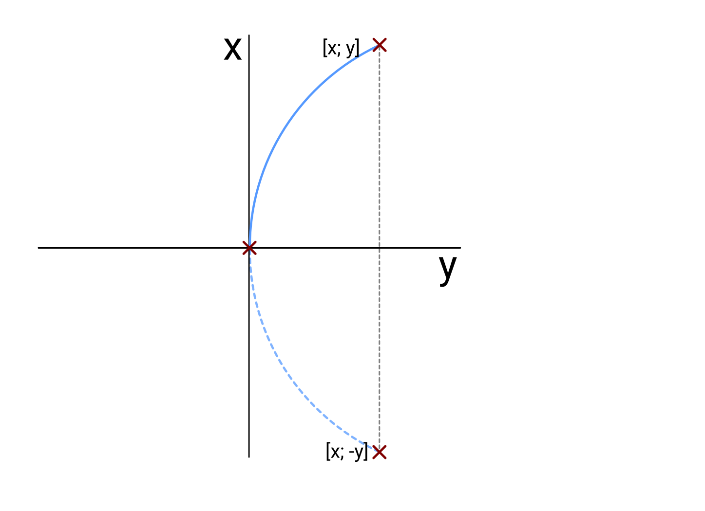

# Představení

Ve vývoji docházím k závěru, že existuje více možností, jak naplánovat jeden krok.

### lineární cesta

- Tato cesta probíhá za podmínky, kdy není v trajektorii překážka a cíl je v úhlu pi / 2 a její délka je rovna přeponě pravoúhlého trojúhelníku utvořeného na základě pravoúhlého trojúhelníku.

**JAK STANOVIT BODY?!**

### pohyb po kružnici

- pro kružnici je v každém případě potřeba trojice bodů

- pohyb po kružnici je ale minimálně dvojího typu, a sice

- 

  #### pohyb z prostředního bodu

   - V tomto případě se jedná o načrtnutí z bodu osy lokálního souřadnicového systému [0; 0]
      a jsou projety pouze 2 ze 3
      
      
      
  - **JAK STANOVIT BODY?!**

    - Jak již bylo napsáno, prostřední bod je vždy v ose souřadnic, což je také bod, na němž by se měl podle lokáních souřadnic měl nacházet
    - Bod [x; y] je stanoven buď podle přesných lokálních souřadnic cíle, nebo se jedná o mezicíl.
      - Proti němu je vygenerován bod, který je mimo záporné y souřadnice identický.

  #### plný pohyb

  - 
  - **JAK STANOVIT BODY?!**
    - V případě tohoto pohybu je krajní ze tří bodů [0; 0] a pro představu stačí říct, že mezibod je vytvořen ve vzdálenosti dané minimální vzdálenosti překážky a robota a vzdálenosti překážky.
    - 