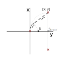

# Představení

<h6><b> Poznámka: všechny osy x a y jsou prohozeny, nejedná se o přepis - celý kříž je otočen o mně neznámý násobek π/2 tak, aby směrem vertikálně byla ukázána cesta robota</b> </h6>

Ve vývoji docházím k závěru, že existuje více možností, jak naplánovat jeden krok.

### lineární cesta

- Tato cesta probíhá za podmínky, kdy není v trajektorii překážka a cíl je v úhlu π / 2 a její délka je rovna přeponě pravoúhlého trojúhelníku utvořeného na základě pravoúhlého trojúhelníku.

**JAK STANOVIT BODY?!**

### pohyb po kružnici

- pro kružnici je v každém případě potřeba trojice bodů

- pohyb po kružnici je ale minimálně dvojího typu, a sice

- 

  #### pohyb z prostředního bodu

   - V tomto případě se jedná o načrtnutí z bodu osy lokálního souřadnicového systému [0; 0]
      a jsou projety pouze 2 ze 3
      
      
      
  - **JAK STANOVIT BODY?!**

    - Jak již bylo napsáno, prostřední bod je vždy v ose souřadnic, což je také bod, na němž by se měl podle lokáních souřadnic měl nacházet
    - Bod [x; y] je stanoven buď podle přesných lokálních souřadnic cíle, nebo se jedná o mezicíl.
      - Proti němu je vygenerován bod, který je mimo záporné x souřadnice identický.

  #### plný pohyb

  - 
  - **JAK STANOVIT BODY?!**
    - V případě tohoto pohybu je krajní ze tří bodů [0; 0] a pro představu stačí říct, že mezibod je vytvořen ve vzdálenosti dané minimální vzdálenosti překážky a robota a vzdálenosti překážky.
    - 

### Dalším určením uskutečnění cesty je funkce sinus v absolutní hodnotě

- robot je nasměřován v π/2 a tam má i |sin(y)| = 1.
  - naopak směrem kol (0 a π) je 0 → tímto směrem je nejvíc nevýhodné se pohybovat, stejně jako směry blízkými
- pokud je cíl robota vůči němu na **y**, kde platí, že **|sin(y)| < |cos(y)|**, je vhodné se pohybovat skrze více kroků.

### Další možný určovač pro tvorbu cesty je poměr vzdáleností 

- Tady se pracuje s tím, že **x** středu kružnice **je rovno nule**

  - principem je jednoduché porovnání lokálních vzdáleností (vzdálenost středu a bodu od osy lokálních souřadnic) na ose **y**

    #### střed je blíž:

    - 

    - 

      #### Střed je dál nebo je stejně

      - 

      #### Střed je prostě moc daleko

      - toto je stvořené pro případ, kdy se lze na stejné místo dostat skrze 2 pohyby s tím, že je průměrná rychlost vyšší a dráha menší
- 

#### Následující tabulka ukazuje postup při tvorbě cesty na určenou destinaci (důležité si povšimnout především toho, že celá cesta je tvořena především z kružnicových oblouků a přímých linek)

|  |  |  |  |
| ------------------------------------------------------------ | ------------------------------------------------------------ | ------------------------------------------------------------ | ------------------------------------------------------------ |
|                                                              |

A následující obrázek již akorát znázorňuje, že vše mohlo proběhnout bezztrátověji.

- Ztrátou v předešlém postupu bylo především špatné určení kurzu, které způsobilo, že se před překážkou vlivem objíždění objektu ztratila rychlost zpomalením do zatáčky a prodloužila trasa. Nutné je proto kroky v každém bodu / sekvenci naplánovat.
  - Tady je vhodné říct, že zde je krok 1 a 2 příkladem rozložení většího kroku.
    - tento větší krok byl zamýšlen k vyhnutí se překážce
    - samotný bod by ale byl dále než střed kružnice, z níž byl kružnicový oblouk vyseknut
    - naopak je jeto po kružnici, než je dosažen úhel takový, že je cílový bod na ose robotově ose **y** nulový nebo s opačným znaménkem
      - opačné znaménko svědčí o přejetí možnosti zabočit a potenciálně může prodloužit dráhu.

